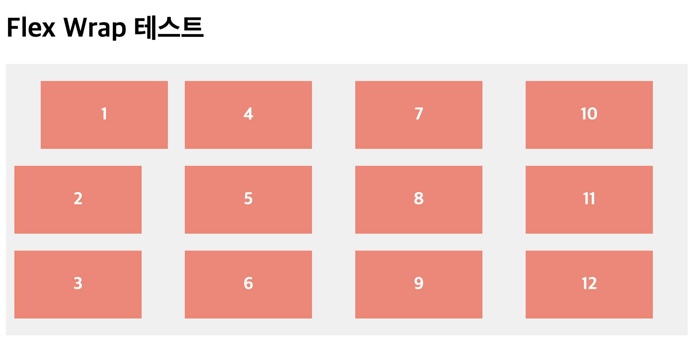

# CSS 심화 학습

## Flex

### flex-flow

**`flex-direction`** 과 **`flex-wrap`** 을 한꺼번에 지정할 수 있는 단축 속성

```css
.container {
  flex-flow: column wrap;
  /* flex-direction: column; */
  /* flex-wrap: wrap; */
}
```

### align-items vs align-content vs align-self

**align-items** 수직축 방향으로 아이템들을 정렬하는 속성  
**align-content**

- 무조건 줄바꿈(flex-wrap: wrap) 속성이 지정된 상태에서 사용 가능
- 세로 여분 공간이 많이 남아있을 때, 수직축 방향으로 아이템들을 정렬함.
  align-self
- align-items/content는 컨테이너에서 아이템을 전체적으로 움직이는데,
- align-self는 각 아이템별로 움직일 수 있다.

아래 그림은 1번 아이템에 align-self:end 속성을 개별 지정했을 때 모습이다.


## ⭐️Flex 아이템에 적용하는 속성들

### flex-basis

Flex **아이템의 기본 크기**를 설정(flex-direction이 row일 때는 너비, column일 때는 높이).

### flex-grow

flex-grow는 아이템이 **flex-basis의 값보다 커질 수 있는지를 결정**하는 속성  
0보다 큰 값이 세팅이 되면 해당 아이템이 **`유연한(Flexible) 박스`** 로 변하고 원래의 크기보다 커지며 빈 공간을 메우게 된다.

flex-grow에 들어가는 숫자의 의미는, 아이템들의 flex-basis를 제외한 **여백 부분을 flex-grow에 지정된 숫자의 비율로 나누어 가진다**고 생각하면 된다.

### flex-shrink

flex-grow와 쌍을 이루는 속성으로, 아이템이 flex-basis의 값보다 작아질 수 있는지를 결정  
flex-shrink에는 숫자값이 들어가는데, 몇이든 일단 0보다 큰 값이 세팅이 되면 해당 아이템이 유연한(Flexible) 박스로 변하고 flex-basis보다 작아진다
기본값이 1이기 때문에 따로 세팅하지 않았어도 아이템이 flex-basis보다 작아질 수 있었다.

flex-shrink를 0으로 세팅하면 아이템의 크기가 flex-basis보다 작아지지 않기 때문에 고정폭의 컬럼을 쉽게 만들 수 있다.

고정 크기는 width로 설정

```css
.container {
  display: flex;
}
.item:nth-child(1) {
  flex-shrink: 0;
  width: 100px;
}
.item:nth-child(2) {
  flex-grow: 1;
}
```

flex-shrink: 0; 덕분에 컨테이너가 아무리 작아져도 첫번째 아이템은 찌그러지지 않고 폭이 100px로 유지된다.

### ⭐️⭐️⭐️ flex

flex-grow, flex-shrink, flex-basis를 한 번에 쓸 수 있는 축약형 속성  
이 세 속성들은 서로 관련이 깊기 때문에, 이 축약형을 쓰는 편이 여러모로 편리하다!

```css
.item {
  flex: 1;
  /* flex-grow: 1; flex-shrink: 1; flex-basis: 0%; */
  flex: 1 1 auto;
  /* flex-grow: 1; flex-shrink: 1; flex-basis: auto; */
  flex: 1 500px;
  /* flex-grow: 1; flex-shrink: 1; flex-basis: 500px; */
}
```

주의할 점은, flex: 1; 이런 식으로 flex-basis를 생략해서 쓰면 flex-basis의 값은 0이 된다.

```css
.item {
  flex: 1 1 0;
}
.item:nth-child(2) {
  flex: 2 1 0;
}
```

flex-basis: 0; 으로, 기본 점유 크기를 0으로 만들어버려 결국 전체 크기를 1:2:1로 나누어 가져서, 영역 자체의 크기가 정확히 1:2:1의 비율로 설정  
여백의 비가 아닌, 영역 자체를 원하는 비율로 분할하기를 원한다면 이렇게 flex-basis을 0으로 하면 손쉽게 처리할 수 있게 됨.

```css
.container {
  display: flex;
  flex-wrap: wrap;
}
.item {
  flex: 1 1 40%;
}
```

flex-basis가 40%면, 100%에는 2개까지만 들어가므로 하나의 row에는 2개까지만 남고 다음줄로 넘어가게 되어서 2단 컬럼이 유지가 된다. (30%면 3단이 될 것)

### z-index

z-index로 Z축 정렬을 할 수 있어요. 숫자가 클 수록 위로 올라옵니다.
(position에서의 z-index랑 똑같이 생각하면 됨)

```css
.item:nth-child(2) {
  z-index: 1;
  transform: scale(2);
}
/* z-index를 설정 안하면 0이므로, 1만 설정해도 나머지 아이템을 보다 위로 올라온다 */
```
