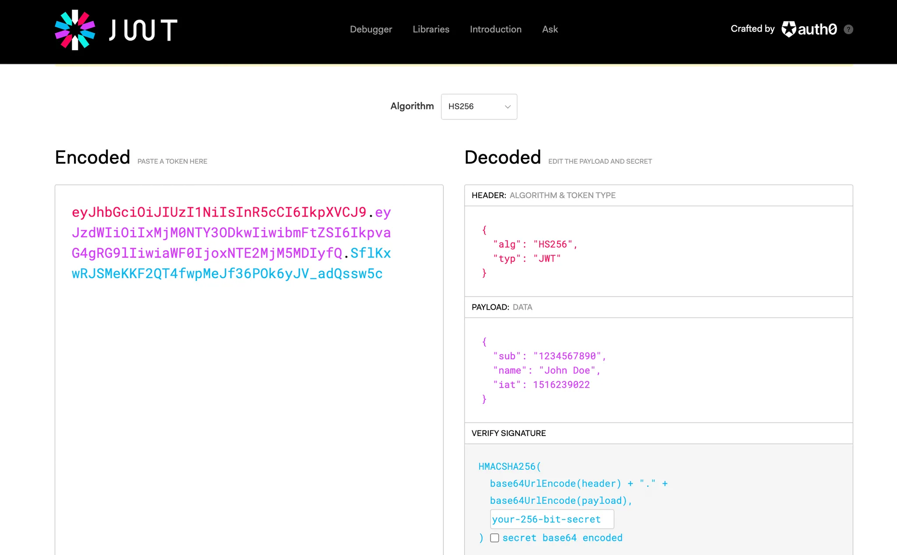

# 로그인의 역사

## 1. cookies/session login

1.  브라우저에서 ID/PW 입력 후 로그인 시도(백엔드로 loginAPI 요청)
2.  백엔드에서 브라우저에게 전달받은 유저정보가 DB에 존재하는지 확인
3.  존재하면 session에 저장 후, 사용자 고유식별 id를 부여하여 브라우저로 전송
4.  브라우저는 해당 id를 api 요청 시에 사용

이렇게, 백엔드 서버가 유저의 로그인 정보를 받다보니 한번에 여러명의 정보를 받기엔 한계가 있음
=> 백엔드 컴퓨터 성능을 올려주는 방식으로 완화(scale-up)

## 2. 백엔드 컴퓨터 복사(서버의 부하를 분산시키는 방식)

1번 로그인 방식의 한계를 개선하기 위해 백엔드 컴퓨터의 성능을 올려줬음에도 불구하고, 만약 더 많은 유저의 접속이 **동시 다발적**으로 일어나면 여전히 서버의 부하를 초래함.  
=> 유저의 정보가 담기는 백엔드 컴퓨터를 복사해 **여러대의 컴퓨터로 백엔드 서버의 부하를 분산(scale-out)**

그러나, 각 백엔드 컴퓨터는 로그인 정보가 담긴 세션을 가지고 있다(stateful).  
백엔드 컴퓨터를 복사할때는 세션까지 scale out이 안되기때문에 기존의 로그인 정보를 가지고 있던 백엔드 컴퓨터가 아니면, 로그인 정보가 없게된다.

또한, 백엔드 서버가 여러 대여도 접근하는 DB는 하나이기 때문에 결국 DB로 부하가 몰리는 **병목현상(bottle-neck)**이 일어난다.

> **scale-out**  
> 똑같은 성능의 컴퓨터를 추가하는 것

## 3. 데이터베이스 수직/수평 파티셔닝(feat.Redis)

2번 방식에서 존재하는 문제인 session을 scale-out해오지 못하는 문제점을 보완하고 DB에 부하가 몰리는 병목현상을 해소한 방법이고 현재 많이 쓰이고 있는 방법이다.

우선, DB는 데이터가 영구적으로 저장되기 때문에 RAM이 아닌 disk에 저장이 된다.  
DISK I/O 작업은 **안전하지만 느리다**. 이렇게 disk에 저장된 데이터를 추출해 오는 것을 DB를 긁는다(**scrapping**)이라고 표현한다.

DB 병목현상을 해소하기 위해서는 DB를 쪼개는 수직/수평 파티셔닝 방법이 있다. (DB복사는 비용문제가 발생함)

- 테이블을 수직으로 쪼개는 **수직 파티셔닝**
- 테이블을 수평으로 쪼개는 **수평 파티셔닝(샤딩)**

또한, disk I/O 작업 속도를 향상시키기 위해 메모리에 데이터를 저장하는 임시DB **`Redis`** 에 저장해둔다.

> **Redis**  
> 메모리에 저장해두는 임시 데이터 베이스 => 메모리에 저장하기 때문에 디스크 보다 빠르다

이렇게 저장된 특정 ID(토큰)을 다시 브라우저로 돌려주게 되고,

돌려받은 토큰은 브라우저 저장공간에 토큰을 저장해두고 어떤 행동을 할때 토큰을 같이 보내주어 사용자가 누구인지 식별한다.

백엔드 컴퓨터는 stateless 상태가 된다.

## 4. JWT로그인

굳이 로그인 정보를 서버나 DB에 저장해야 할까?
=> JWT는 유저 정보를 서버에 저장을 하지 않는다.

### JWT 동작 방식

1. 유저 정보를 담은 객체를 문자열로 변환 후 `암호화`
2. `암호화된 키(access token)`를 브라우저에 전송
3. 브라우저 저장소에 `키를 저장`한 후 api 요청에 헤더로 함께 전달하면, 백엔드에서 `복호화`해서 사용자를 식별한 후 접근이 가능하게 됨.

JWT 토큰에는 해당 토큰이 **발급 받아온 서버에서 정상적으로 발급을 받았다는 증명을하는 signature** 를 가지고 있다.

따라서 사용자의 정보를 **DB를 열어보지 않고도 식별할 수 있다**

> - **양방향 암호화**
>   암호화, 복호화 모두 할 수 있는 암호화를 말한다. (ex: JWT 토큰)
> - **단방향 암호화(hash)**
>   암호화는 되지만, 복호화는 안되는 것을 말다.  
>   원래 정보가 뭔지 모르게 만드는 것  
>   => 레인보우 테이블로 무작정 다 대입해서 복호화 하는 경우도 있어서 어려운 알고리즘을 추가하기도 함.

### 💡tip

> **authentication과 authorization**  
> → **authentication(인증)** : 로그인을해서 토큰을 받아오는 과정  
> → **authorization(인가)** : 리소스에 접근할 수 있도록 토큰을 확인하는 과정

## JWT 토큰의 조작 불가능성

jwt.io 사이트에서 토큰 decode가 가능한데, 사진과 같이 토큰에 대한 정보가 모두 보이고 있다. 이처럼 누군가 우리의 토큰을 탈취해 해당 사이트에 넣어보면 토큰의 정보를 알 수 있습니다.

즉, **JWT토큰은 암호화는 했지만 누구든 열어볼 수 있다는 것** 이다.

따라서 **중요한 데이터는 JWT 토큰에 저장해서는 안된다!**

### 💡tip

> **_JWT 토큰의 구성_**
>
> 1. **header** : 토큰의 타입, 암호화시 사용한 알고리즘 정보
> 2. **payload** : 토큰 발행정보(누구인지, 언제 발행되었는지, 언제 만료될 것 인지)
> 3. **signature** : 토큰의 비밀번호

### 그러면 JWT는 사용하면 안되는가?

누구든지 복호화가 가능하기 때문에 보안을 위해 **토큰의 만료시간을 짧게** 준다.  
그러나 복호화된 정보에는 토큰의 만료시간이 명시되어있었고,즉 조작을 할수도 있다는 것 이다.

하지만 이런 **조작을 미연에 방지하기 위해 JWT는 signature(토큰의 비밀번호)를 사용한다.**  
**토큰의 내용을 조작하기 위해선 토큰의 비밀번호(signature)를 알아야 한다는 것** 입니다.  
해당 비밀번호는 백엔드에서 생성하며, 알 수 없다.
